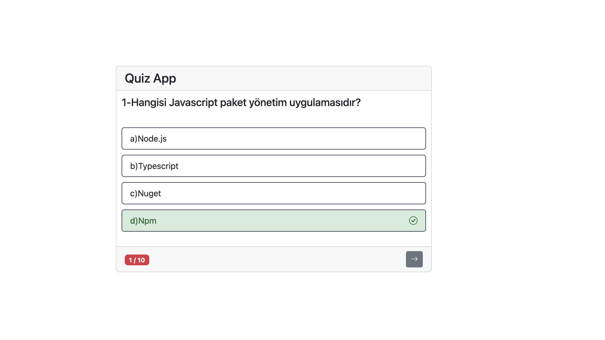
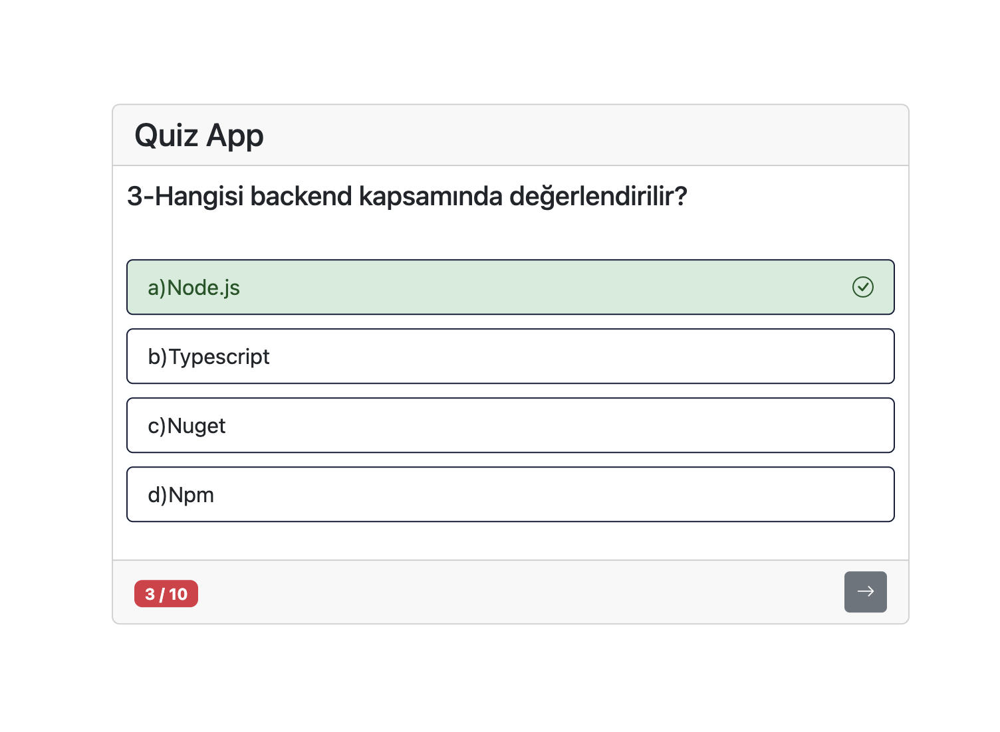
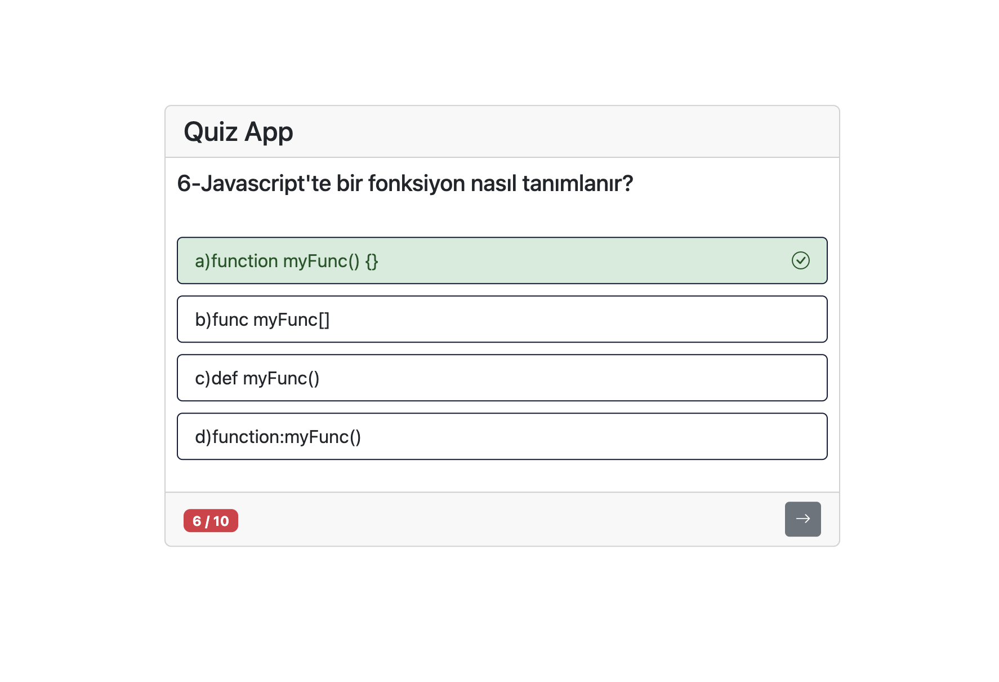
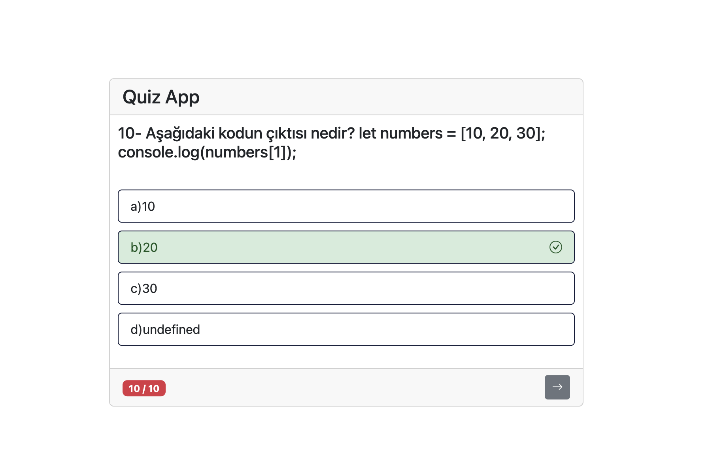
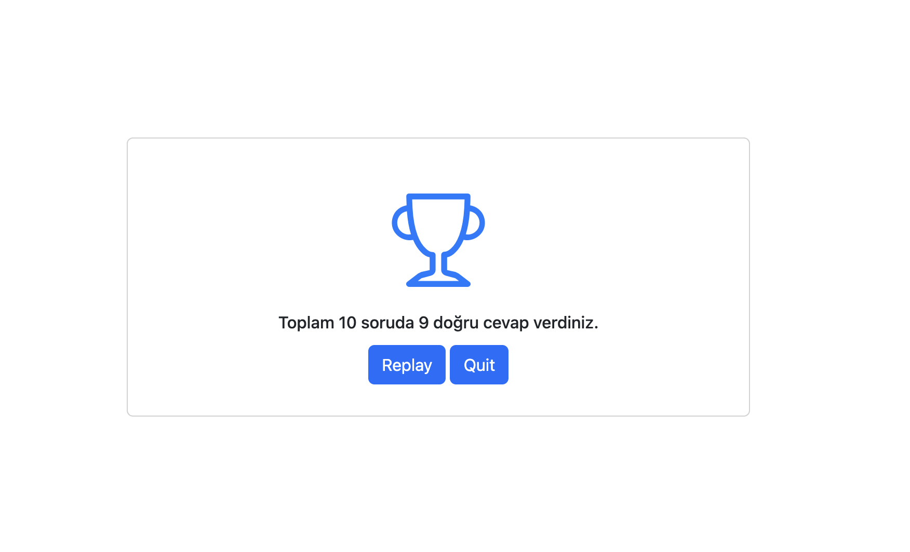

#  Quiz App

A simple JavaScript quiz application consisting of 10 questions. Users answer each question and receive instant feedback: correct answers are highlighted in **green**, incorrect answers in **red**. At the end of the quiz, the total score is displayed. Users can choose to **replay** the quiz or **quit**.

## Features

- 10 multiple-choice questions
- Correct answers are highlighted in green
- Incorrect answers are highlighted in red
- Final score is displayed at the end
- **Replay** button to restart the quiz
- **Quit** button to exit the quiz

## Technologies Used

- HTML
- CSS
- JavaScript

## Setup / Installation

1. Clone the repository or download it as a ZIP file:  
   git clone https://github.com/YaremMalta/QuizApp.git
2. Open the `index.html` file in your browser.  
3. Start using the application.

## Screenshots

